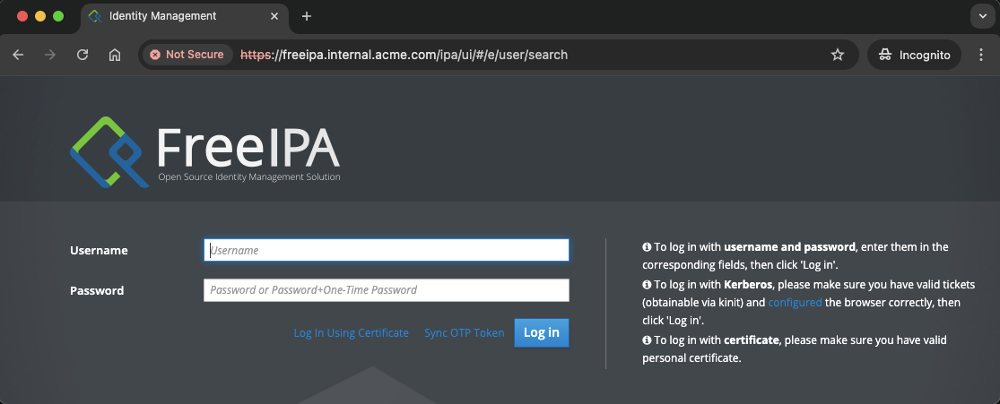
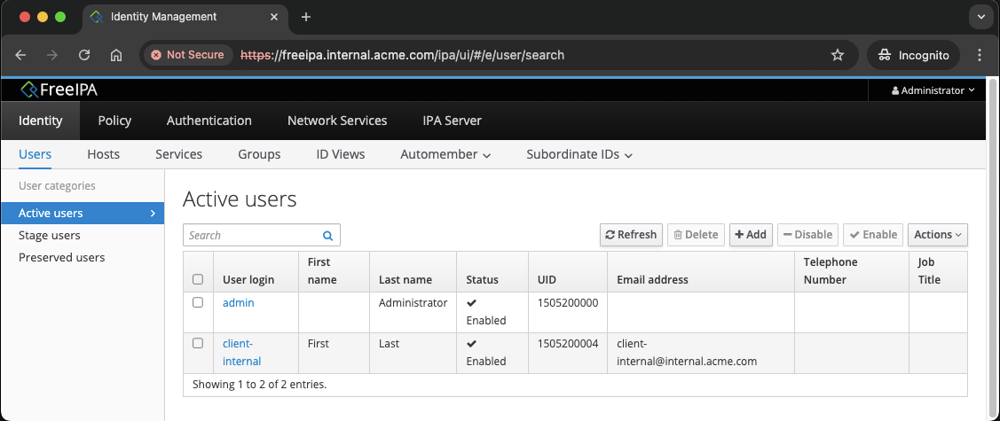
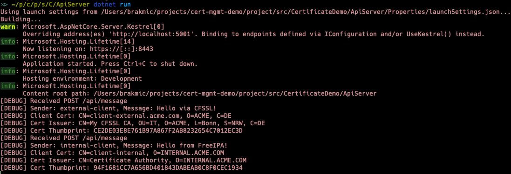
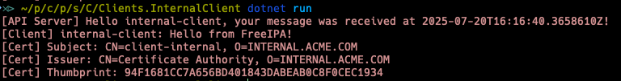
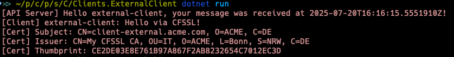
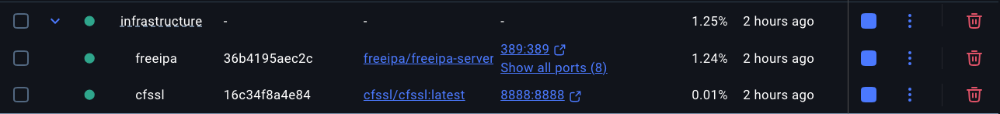

# Secure PKI Certificate Management with mTLS: FreeIPA, CFSSL, and .NET

## Overview

This repository demonstrates **end-to-end certificate lifecycle management** for secure services using:

- **FreeIPA** (internal CA)
- **CFSSL** (external CA)
- **.NET 9 / C# 12** (API server, clients, web server)
- **Docker Compose** (for infrastructure orchestration)

It covers real-world scenarios for mTLS authentication, certificate enrollment, and secure communication between internal/external clients and servers.

---

## What is FreeIPA?

**FreeIPA** is an open-source identity management and certificate authority solution for Linux and UNIX environments.  
It provides centralized authentication, authorization, and account information by combining LDAP, Kerberos, DNS, and a built-in CA.  
[FreeIPA](https://www.freeipa.org/) is commonly used for managing internal users, hosts, and services, and for issuing certificates trusted within an organization.

## What is CFSSL?

**CFSSL** (Cloudflare's PKI/TLS toolkit) is a powerful and flexible open-source certificate authority and toolkit for managing TLS certificates.  
It is designed for automated certificate issuance, renewal, and validation, making it ideal for external services and cloud-native environments.  
[CFSSL](https://github.com/cloudflare/cfssl) is widely used for scalable certificate management outside traditional enterprise boundaries.

---

## Scenario & Use Cases

| Use Case                        | Client CA   | Server CA   | Port   | Description                                      |
|----------------------------------|-------------|-------------|--------|--------------------------------------------------|
| Internal client → API Server     | FreeIPA     | FreeIPA     | 8443   | Trusted internal service authenticates via mTLS   |
| External client → API Server     | CFSSL       | CFSSL       | 8443   | External service authenticates via mTLS           |
| Browser → Web Server            | (optional)  | CFSSL       | 9443   | User accesses dashboard, optionally with mTLS     |

---

## Project Structure

```ascii
infrastructure/
├── docker-compose.yaml   # For infrastructure services
├── cfssl/                # CFSSL CA config & files
│   └── config/           # CA keys, config.json, etc.
├── freeipa/              # FreeIPA CA config & files
│   └── certs/            # CA certificate archive, etc.
├── temp/                 # Temporary files (CSRs, keys, certs)
src/
└── CertificateDemo/
    ├── ApiServer/                # .NET Web API (mTLS)
    ├── WebServer/                # .NET Razor Pages (mTLS optional)
    ├── Clients.InternalClient/   # Console client (FreeIPA cert)
    ├── Clients.ExternalClient/   # Console client (CFSSL cert)
    ├── Common/                   # Shared models & certificate logic
    └── CertificateDemo.sln       # Solution file
```

---

## Architecture

```ascii
+-------------------+      mTLS (FreeIPA CA)      +-------------+
| Internal Client   | <-------------------------> | API Server  |
+-------------------+                             +-------------+
        |                                               |
        |                                               |
        |                                               |
        |                                               |
+-------------------+       mTLS (CFSSL CA)       +-------------+
| External Client   | <-------------------------> | API Server  |
+-------------------+                             +-------------+

      [Both clients can access the API Server using their respective CA certificates]
```

### Trust Domains

```ascii
+-------------------+         +-------------------+
|   FreeIPA CA      |         |    CFSSL CA       |
| (internal trust)  |         | (external trust)  |
+-------------------+         +-------------------+
        |                             |
        v                             v
+-------------------+         +-------------------+
| Internal Client   |         | External Client   |
+-------------------+         +-------------------+
```

### Web Server (Browser & mTLS)

```ascii
+-------------------+      HTTPS (optional mTLS)      +-------------+
|   Browser/User    | <-----------------------------> |  Web Server |
+-------------------+                                 +-------------+
        |                                                   ^
        |                                                   |
        |      [If client cert presented, info shown]       |
        +---------------------------------------------------+
```

---

## Purpose of Each Project

This solution demonstrates how to build a secure PKI ecosystem using mutual TLS (mTLS) and certificate authorities. Each component plays a distinct role in the overall architecture:

- **infrastructure/docker-compose.yaml**  
  *Unified Infrastructure Orchestration*  
  Defines and runs both FreeIPA and CFSSL containers as part of a single "infrastructure" group. This ensures both CAs are started and managed together, simplifying development and integration.

- **infrastructure/cfssl/**  
  *External Certificate Authority (CA)*  
  Contains configuration and keys for CFSSL, which issues certificates to external clients and services. Enables secure onboarding and management of third-party identities.

- **infrastructure/freeipa/**  
  *Internal Certificate Authority & Identity Management*  
  Contains configuration and CA certificates for FreeIPA, which manages internal users, hosts, and certificates. Acts as the root of trust for internal services and users.

  
  

- **src/CertificateDemo/ApiServer/**  
  *Secure API Gateway*  
  A .NET Web API that enforces mTLS for all connections, validating client certificates from both internal and external sources.

  

- **src/CertificateDemo/WebServer/**  
  *Secure Web Dashboard*  
  A .NET Razor Pages application that optionally displays client certificate information, demonstrating browser-based mTLS authentication.

- **src/CertificateDemo/Clients.InternalClient/**  
  *Internal Service Client*  
  Simulates an internal service or user, authenticating to the API Server with a FreeIPA-issued certificate.

  

- **src/CertificateDemo/Clients.ExternalClient/**  
  *External Service Client*  
  Represents an external partner or service, authenticating to the API Server with a CFSSL-issued certificate.

  

- **src/CertificateDemo/Common/**  
  *Shared Models & Certificate Logic*  
  Contains reusable data models and certificate provider abstractions for consistent certificate handling across all components.

---

## Getting Started

### Prerequisites

- **.NET 9 SDK**  
  ```bash
  sudo add-apt-repository ppa:dotnet/backports
  sudo apt update
  sudo apt install -y dotnet-sdk-9.0
  dotnet --version
  ```

- **Docker & Docker Compose**  
  ```bash
  sudo apt update
  sudo apt install -y docker.io docker-compose-plugin
  ```

- **CFSSL CLI**  
  ```bash
  sudo apt update
  sudo apt install -y golang-go
  go install github.com/cloudflare/cfssl/cmd/cfssl@latest
  go install github.com/cloudflare/cfssl/cmd/cfssljson@latest
  export PATH=$PATH:$(go env GOPATH)/bin
  ```

---

## Certificate Generation Workflow

- **Internal certificates**: Generated and signed by FreeIPA.
- **External certificates**: Generated and signed by CFSSL.
- **Server certificates**: Generated for API Server and Web Server, signed by the appropriate CA.

See [Certificate Generation Workflows](./doc/cert-gen.md) for step-by-step instructions.

---

## Basic Commands

### Build the Solution

```bash
cd src/CertificateDemo
dotnet build
```

---

### Start Infrastructure (FreeIPA & CFSSL)

```bash
cd infrastructure
docker compose up -d
```
- Both FreeIPA and CFSSL containers will run in parallel under the same "infrastructure" group.



---

### Run the API Server

```bash
cd src/CertificateDemo/ApiServer
dotnet run
```
- Listens on port **8443** (HTTPS, mTLS required).

---

### Run the Web Server

```bash
cd src/CertificateDemo/WebServer
dotnet run
```
- Listens on port **9443** (HTTPS, optional mTLS).

---

### Run Internal Client

```bash
cd src/CertificateDemo/Clients.InternalClient
dotnet run
```
- Authenticates to API Server using FreeIPA certificate.

---

### Run External Client

```bash
cd src/CertificateDemo/Clients.ExternalClient
dotnet run
```
- Authenticates to API Server using CFSSL certificate.

---

### Test Web Server in Browser

```bash
$BROWSER https://localhost:9443
```
- If a client certificate is presented, the index page will display its subject.

---

### Test API/Web Server with curl

```bash
curl -k \
  --cert src/CertificateDemo/Clients.ExternalClient/certs/client-external.pem \
  --key src/CertificateDemo/Clients.ExternalClient/certs/client-external-key.pem \
  https://localhost:9443
```

---

## Tips & Troubleshooting

- Use `curl` with `-k` and `--cert/--key` for manual endpoint testing.
- For browser-based mTLS, import the client certificate into your browser’s certificate store (see tutorial for details).
- If you have issues with certificate import on macOS, try exporting with a simple password and modern encryption (`AES-256-CBC`).
- Check logs in Docker Desktop and .NET console output for errors.
- For Kerberos/FreeIPA, ensure system clocks are synchronized.

---

## License

[MIT](./LICENSE)
